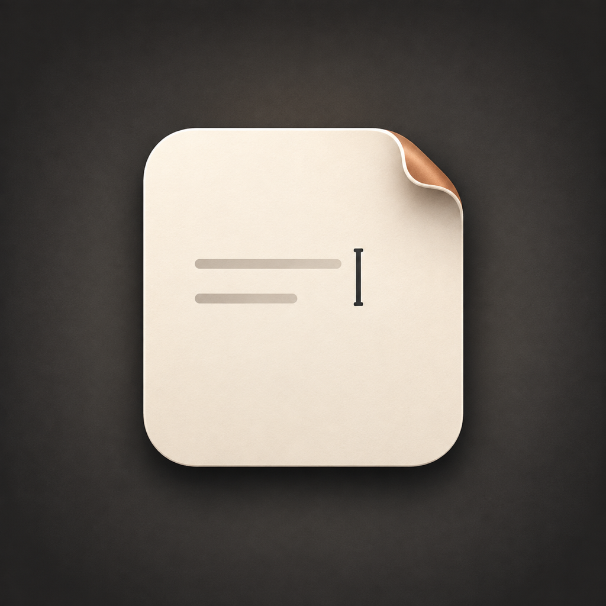

<p align="center">
  
</p>

# Aparte

Aparte is a native macOS writing pad that is always one shortcut away. Press
Option-Space, write, copy or save what you need, then press Escape. The same
local document is waiting when you come back.

[Download the latest release](https://github.com/pocarles/Aparte/releases/latest/download/Aparte.dmg)
or read the [product page](https://pocarles.com/aparte/).

## What it does

- Opens from any app with Option-Space.
- Dims the rest of the screen without taking over your desktop.
- Supports headings, lists, links, bold, italic, and underline.
- Copies clean Markdown or saves a Markdown file where you choose.
- Autosaves one local document and restores it on relaunch.
- Settles near zero CPU while hidden.

Aparte has no account, cloud sync, analytics, advertising, updater, network
connection, or third-party package dependency.

## Install

Aparte requires macOS 14 or later and includes native Apple silicon and Intel
code.

1. Download [`Aparte.dmg`](https://github.com/pocarles/Aparte/releases/latest/download/Aparte.dmg)
   and [`Aparte.dmg.sha256`](https://github.com/pocarles/Aparte/releases/latest/download/Aparte.dmg.sha256).
2. Optionally verify the download in Terminal:

   ```sh
   shasum -a 256 -c Aparte.dmg.sha256
   ```

3. Open the disk image and drag Aparte to Applications.

Public release files come from the protected GitHub workflow. The app is signed
with Developer ID, notarized by Apple, and checked by Gatekeeper before GitHub
publishes it.

## Shortcuts

| Action | Shortcut |
| --- | --- |
| Show or hide Aparte | Option-Space |
| Dismiss | Escape |
| Bold | Command-B |
| Italic | Command-I |
| Underline | Command-U |
| Copy as Markdown | Command-Shift-C |
| Save Markdown As | Command-Shift-S |

## Privacy

Aparte stores one Markdown document in your macOS Application Support folder.
It does not send the document, usage data, or diagnostics anywhere. Read the
[privacy statement](PRIVACY.md) for the complete boundary.

## Build from source

Install Xcode 16 or a newer Swift 6 toolchain, then run:

```sh
git clone https://github.com/pocarles/Aparte.git
cd Aparte
make check
make run
```

`make check` runs the unit tests, builds the app, exercises its native runtime
acceptance checks, and verifies the package signature. `make check-direct`
also builds and verifies the Universal 2 disk-image shape without Apple
credentials.

The source-built app is ad-hoc signed for the Mac that built it. Use the
notarized GitHub release when installing Aparte on another Mac.

## Project boundary

Aparte is one focused document, not a notes library. The source stays native,
local, and quiet. See [CONTRIBUTING.md](CONTRIBUTING.md),
[SECURITY.md](SECURITY.md), and [docs/architecture.md](docs/architecture.md).

## License

MIT. Copyright © 2026 Pierre-Olivier Carles. See [LICENSE](LICENSE).
